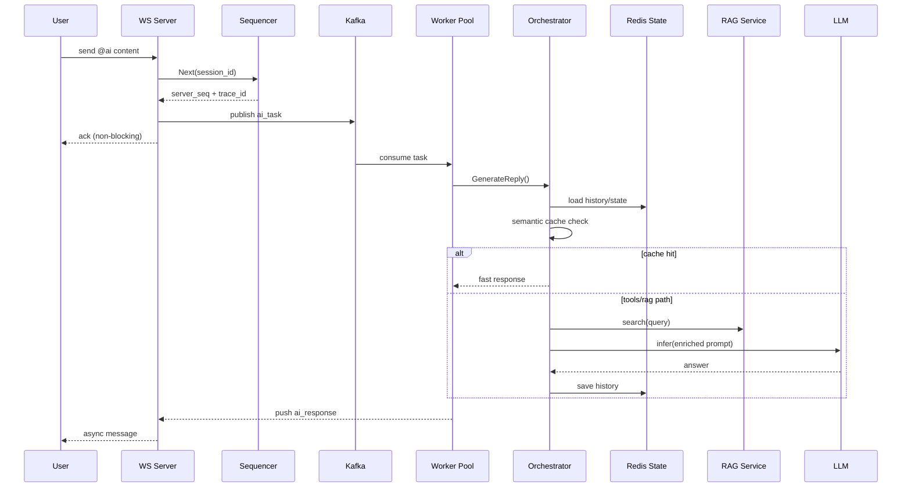

# Agent 协同架构设计说明

本文档是 `README.md` 的技术细化版，重点解释 Agent 协同链路、异步调度策略、状态机与检索增强方案。

## 1. 设计目标

- 通讯优先：任何 AI 推理都不能阻塞 WebSocket 主链路。
- 智能可扩展：支持角色路由、工具调用、RAG 与语义缓存。
- 链路可追踪：每条消息具备 `server_seq` 与 `trace_id`。
- 上下文可隔离：按 `(user_id, session_id)` 管理多轮对话状态。

## 2. Agent 总体架构

```mermaid
flowchart LR
  M[@ai Message] --> Q[Queue Layer: Kafka / Channel]
  Q --> P[AI Worker Pool]
  P --> O[Agent Orchestrator]

  subgraph Capability[Agent Capability]
    O --> S[Session Manager]
    O --> C[Semantic Cache]
    O --> T[Function Calling]
    O --> R[RAG Retrieval]
    O --> L[LLM Inference]
  end

  L --> RESP[Async Response Writer]
  RESP --> WS[WebSocket Push]
```

## 3. 请求处理时序



## 4. 关键模块说明

## 4.1 Sequencer

文件：`internal/service/sequence/sequence_service.go`

职责：

- `Next(sessionID)`：会话级递增序号。
- `TraceID(sessionID, senderID, seq)`：构建可追踪链路 ID。
- GC：自动回收长时间无访问会话计数器。

价值：

- 排障时可快速定位消息乱序、重复投递、延迟异常。

## 4.2 Session Manager (Redis 状态机)

文件：`internal/service/ai/redis_session_manager.go`

状态定义：

- `idle`
- `in_conversation`
- `waiting`

能力：

- 历史窗口截断，防止上下文无限增长。
- 群聊上下文窗口构建，增强多用户语境理解。

## 4.3 Semantic Cache

文件：`internal/service/ai/semantic_cache.go`

能力：

- Embedding + 余弦相似度拦截高频重复问题。
- 优先命中快速路径，降低 LLM 调用成本。

可调参数：

- `SimilarityThreshold`
- `MaxEntries`
- `TTL`

## 4.4 Function Calling

文件：`internal/service/ai/function_calling.go`

内置工具：

- `get_current_time`
- `calculator`
- `get_weather`
- `search_knowledge_base`
- `summarize_chat_history`

## 4.5 RAG 检索增强

文件：`internal/service/ai/rag_service.go`

方案：

- Dense 检索：语义向量相似度。
- Sparse 检索：关键词匹配。
- RRF 融合：平衡语义相关性与关键词精度。

## 5. 失效与降级策略

- 协程池满载：降级到兜底异步执行，避免消息丢失。
- 外部工具失败：返回可解释错误，不中断会话。
- RAG 不可用：退回纯 LLM 路径。
- 缓存不可用：直接推理，保证可用优先。

## 6. 测试覆盖

- `internal/service/sequence/sequence_service_test.go`
- `internal/service/ai/function_calling_test.go`
- `internal/service/ai/rag_service_test.go`

建议持续补充：

- 状态机并发一致性测试
- 高并发下序列号冲突测试
- Agent 端到端集成测试
