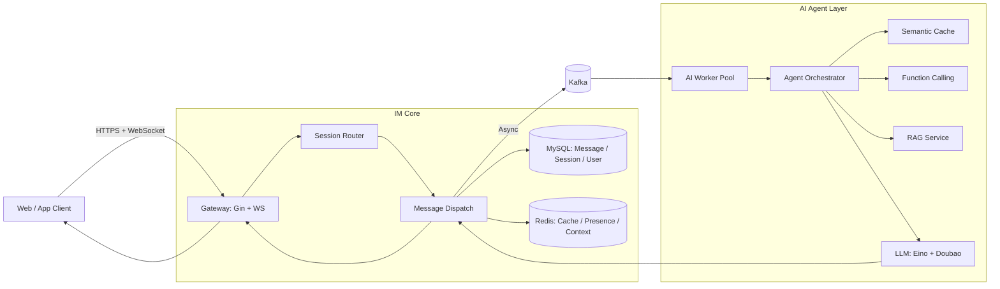
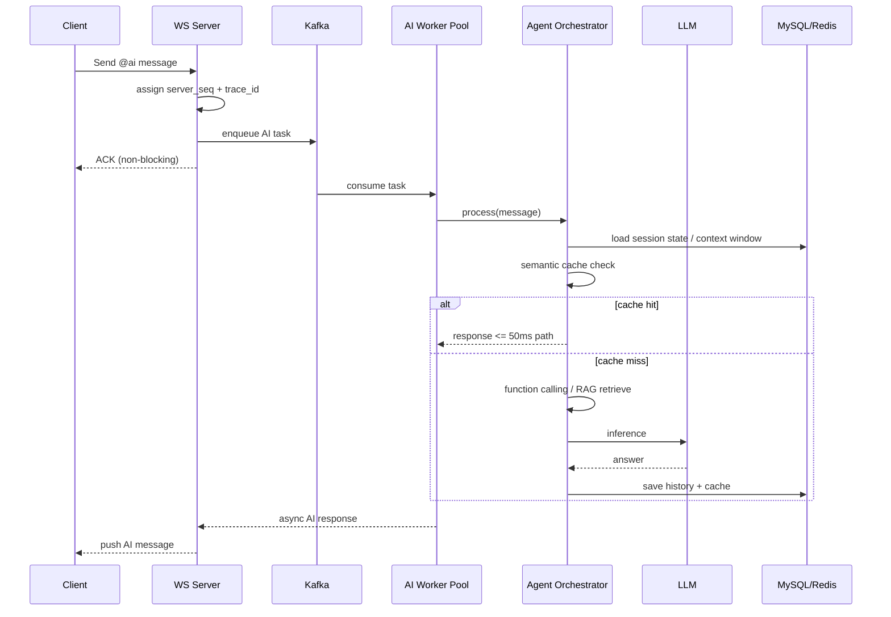

# GO_Chat: Agent 协同的分布式 IM 系统

> 基于 Go 构建的分布式即时通讯系统，支持单聊/群聊/离线消息/文件传输，并集成角色化 AI Agent。
> 重点解决 LLM 高延迟导致主链路阻塞的问题，通过 `Kafka + 协程池 + 状态机 + 语义缓存 + RAG` 实现稳定、可扩展的智能 IM 架构。

## TL;DR

- 通讯核心：`WebSocket + Gin + GORM + Redis + Kafka`
- 智能核心：`Eino Agent + Function Calling + Redis 会话状态机 + RAG`
- 稳定性核心：`AI 推理主链路隔离`、`会话级 server_seq`、`trace_id 可追踪`
- 面试可讲点：从高并发通讯到智能编排全链路闭环

## 项目亮点

1. 主链路稳定性设计：AI 任务通过 `Kafka 缓冲 + 协程池` 异步处理，避免 WebSocket 分发阻塞。
2. 消息可靠性增强：引入会话级 `server_seq` 递增机制，结合 `trace_id` 支持全链路追踪与排障。
3. 智能能力工程化：角色化 Agent 支持 `@ai` 唤醒、Function Calling、RAG 检索、语义缓存。
4. 多轮上下文隔离：Redis 状态机按 `(user_id, session_id)` 管理对话历史与群聊上下文窗口。
5. 可复现与可观测：提供 benchmark、单元测试、`/metrics` 指标接口与清晰的模块划分。

## 系统架构图

### 1) 总体架构



### 2) AI 异步解耦链路（关键设计）



## 核心技术设计

### 通讯层

- WebSocket 长连接通信，支持文本、文件、音视频信令。
- `channel` 与 `kafka` 双模式切换，便于单机开发与分布式扩展。
- Ping/Pong 心跳保活，异常连接自动回收。

### 存储层

- MySQL：消息、会话、联系人等核心业务数据持久化。
- Redis：热点消息列表、在线状态、AI 多轮上下文与群聊窗口缓存。

### 智能层

- 角色化 Agent：根据用户意图自动切换 `Tech/Ops/Tutor/General` 角色。
- Function Calling：时间、天气、计算、知识库检索、会话摘要工具。
- RAG：Dense + Sparse + RRF 混合检索，降低幻觉并提升相关性。
- 语义缓存：高频问题命中快速响应，降低 token 成本与推理延迟。

### 稳定性与可追踪

- AI 推理主链路隔离：避免耗时任务阻塞通信主循环。
- 会话级序列号：`client_seq` + `server_seq` 保障有序投递和排查能力。
- `trace_id`：跨模块链路追踪，便于定位慢调用与异常路径。

## 数据结构扩展（重要）

以下 DTO 已扩展链路追踪字段：

- `internal/dto/request/chat_message_request.go`
- `internal/dto/respond/get_message_list_respond.go`
- `internal/dto/respond/get_group_messagelist_respond.go`
- `internal/dto/respond/av_message_respond.go`

新增字段：

- `client_seq`: 客户端消息序号（可选）
- `server_seq`: 服务端会话内递增序号
- `trace_id`: 链路追踪 ID

消息示例：

```json
{
  "session_id": "S202603100001",
  "send_id": "U1001",
  "receive_id": "G1002",
  "type": 0,
  "content": "@ai 帮我总结一下今天讨论",
  "client_seq": 108
}
```

服务端回包会包含：

```json
{
  "server_seq": 9012,
  "trace_id": "trc_S202603100001_U1001_9012_1741590000000"
}
```

## 项目结构

```text
GO_Chat/
├── api/v1/                      # HTTP + WS 控制器
├── cmd/kama_chat_server/        # 主服务入口
├── configs/                     # 配置文件
├── docs/
│   └── AGENT_ARCHITECTURE.md
├── internal/
│   ├── config/
│   ├── dao/
│   ├── dto/
│   ├── model/
│   └── service/
│       ├── ai/                  # Agent / Function Calling / RAG / Cache
│       ├── chat/                # WS 服务与消息分发
│       ├── kafka/
│       ├── pool/                # 协程池
│       ├── redis/
│       └── sequence/            # server_seq + trace_id
├── ai-service/                  # 独立 AI gRPC 服务
├── proto/
├── test/
└── web/chat-server/
```

## 快速启动

### 1. 环境准备

- Go `1.20+`
- MySQL `8+`
- Redis `6+`
- Kafka `3.x`（可选，默认 channel 模式可不启）

### 2. 配置

编辑 `configs/config.toml`：

```toml
[mainConfig]
host = "0.0.0.0"
port = 8000

[mysqlConfig]
host = "127.0.0.1"
port = 3306
user = "root"
password = ""
databaseName = "kama_chat_server"

[redisConfig]
host = "127.0.0.1"
port = 6379
password = ""
db = 0

[kafkaConfig]
messageMode = "channel" # channel or kafka
hostPort = "127.0.0.1:9092"
```

### 3. 运行主服务

```bash
cd cmd/kama_chat_server
go run main.go
```

### 4. 运行 AI 微服务（可选）

```bash
cd ai-service
go run main.go
```

## 测试与压测

### 单元测试

```bash
# 协程池 / Chat / SMS
go test -race ./internal/service/pool/ -v
go test -race ./internal/service/chat/ -v
go test ./internal/service/sms/ -v

# Agent 相关
go test ./internal/service/ai/ -v -run TestEvalSimpleExpr
go test ./internal/service/ai/ -v -run TestRAG

# 序列号与 trace
go test ./internal/service/sequence/ -v
```

### Benchmark

```bash
go test ./test/benchmark/ -v -run TestWebSocketConcurrency -timeout 60s
go test ./test/benchmark/ -v -run TestMessageQPS -timeout 60s
go test ./test/benchmark/ -bench=. -benchtime=10s -benchmem
```

## 指标与可观测

`GET /metrics` 返回关键运行状态：

- active connections
- message received/sent
- AI request total/failed
- 可扩展：P99 延迟、队列积压、缓存命中率

## Roadmap

- [ ] 将 mock 检索替换为生产级 Elasticsearch 向量索引
- [ ] 增加 Prometheus + Grafana 监控面板
- [ ] 增加消息投递 ACK/重放机制
- [ ] 增加 E2E 压测脚本与回归基线
